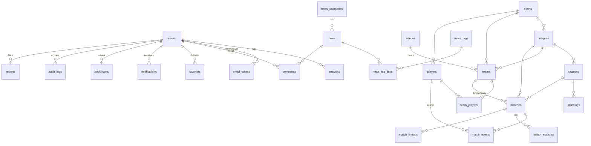

# Database

PostgreSQL 16+. ORM: Drizzle (schema-first, migrations trong `drizzle/`).

## ERD



## Bảng chính (28 bảng)

| Nhóm | Bảng |
|---|---|
| Auth | `users`, `sessions`, `email_tokens` |
| Sports | `sports`, `leagues`, `seasons`, `venues`, `teams`, `players`, `team_players` |
| Matches | `matches`, `match_events`, `match_statistics`, `match_lineups`, `h2h_cache` |
| Standings | `standings` (kèm `previous_position` — movement indicator) |
| News | `news`, `news_categories`, `news_tags`, `news_tag_links`, `comments` |
| Engagement | `favorites`, `notifications`, `bookmarks`, `search_history` |
| Ops | `reports`, `audit_logs`, `job_runs` |

## Constraints & integrity

- **Deduup guarantees**: `matches (external_id, provider)` unique — provider sync không tạo trùng; `teams/players/leagues/news` unique `slug`.
- **CHECK constraints**: `matches_teams_ck` (home ≠ away), `standings_played_ck` (played = won + drawn + lost), `matches_scores_ck` (score ≥ 0), `players_height_ck`, `team_players_shirt_ck`, `comments_len_ck`.
- **Thời gian**: mọi timestamp lưu `timestamptz` (UTC). Frontend convert theo timezone người dùng (`src/lib/format.ts`).

## Index rationale (query-pattern driven)

| Index | Phục vụ query |
|---|---|
| `matches (status, start_time)` | LIVE NOW (filtered by status, sort theo giờ) — hottest query |
| `matches (start_time)` | schedule/results theo ngày |
| `matches (league_id, start_time)`, `(sport_id, start_time)` | filter giải/môn + sort giờ |
| `matches (home_team_id, start_time)`, `(away_team_id, start_time)` | trang team — fixtures/results |
| `matches (season_id)` | standings recompute |
| `news (status, published_at)` | news list published sort mới nhất |
| `news (category_id, published_at)` | filter category |
| `notifications (user_id, is_read, created_at)` | bell unread count + list |
| `favorites (user_id)`, `(favorite_type, target_id)` | profile + fanout notifications |
| `comments (news_id, created_at)`, `(status)` | thread + moderation queue |
| `sessions (token_hash)` unique, `(expires_at)` | auth lookup + purge |
| **GIN trigram**: `teams.name`, `players.name`, `leagues.name`, `news.title` | fuzzy search (`<%` word_similarity + ILIKE) |

Không index cột không được filter/sort. Mọi list query đều có LIMIT + pagination (max 50).

## Scaling path

1. **~10⁴ matches**: hiện tại — B-tree đủ, query p95 < 10ms với seed.
2. **~10⁶ matches**: partition `matches` theo tháng (`start_time`), giữ index cục bộ; `match_events` → append-only table, partitioned theo `match_id` hash.
3. **10⁷+ events**: CDC sang OLAP (ClickHouse) cho analytics; PG giữ горячие 3 tháng.
4. Read replica: repositories đọc qua pool secondary khi `DATABASE_REPLICA_URL` set (chưa bật — đường nâng cấp đã có ở `src/db/index.ts`).

## Backup

```bash
# daily dump (crontab)
docker compose exec db pg_dump -U sport sport | gzip > backup-$(date +%F).sql.gz
# restore
gunzip -c backup-2026-09-02.sql.gz | docker compose exec -T db psql -U sport sport
```

Migration runbook: backup trước `drizzle-kit migrate`; mọi migration additive (thêm cột nullable trước, backfill, rồi mới add constraint).
